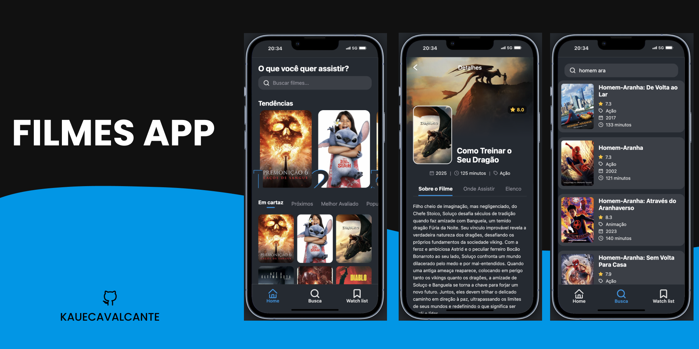

# FilmesApp 🍿

Um aplicativo móvel de descoberta de filmes, construído com React Native e Expo, que permite aos usuários explorar, buscar e ver detalhes sobre seus filmes favoritos, utilizando a API do The Movie Database (TMDB).

Este projeto foi desenvolvido como um exercício prático para solidificar conceitos de desenvolvimento mobile, incluindo navegação, consumo de APIs, gerenciamento de estado e componentização de interface.



---

## ✨ Funcionalidades

* **Tela de Splash:** Uma tela de boas-vindas que aparece na inicialização do app.
* **Navegação por Abas:** Um menu de navegação inferior fixo para acesso rápido às seções principais: Home, Busca e Lista de Desejos.
* **Página Principal Dinâmica:**
    * Exibe um carrossel com os 5 filmes em alta (`Trending`).
    * Permite filtrar filmes por categorias: Em Cartaz, Populares, etc.
    * Grade de filmes que se atualiza dinamicamente com base na categoria selecionada.
* **Busca Funcional:** Campo de busca que navega para uma página de resultados, exibindo os filmes encontrados com detalhes.
* **Página de Detalhes Completa:**
    * Layout profissional com imagem de fundo e pôster sobreposto.
    * Exibe informações detalhadas: título, nota, ano, duração e gênero.
    * Seções para "Sobre o Filme" (sinopse), "Onde Assistir" e "Elenco Principal".
* **Internacionalização:** Todas as informações da API (títulos, sinopses) são solicitadas em Português do Brasil (pt-BR).

---

## 🛠️ Tecnologias Utilizadas

Este projeto foi construído utilizando as seguintes tecnologias e bibliotecas:

* **React Native:** Framework para desenvolvimento de aplicativos móveis.
* **Expo:** Plataforma e conjunto de ferramentas para facilitar o desenvolvimento com React Native, incluindo:
    * **Expo Router:** Para navegação baseada em arquivos e rotas dinâmicas.
    * **Expo Font:** Para o carregamento de fontes customizadas (Montserrat).
    * **Expo Linear Gradient:** Para criar os efeitos de gradiente.
* **TypeScript:** Para adicionar tipagem estática e segurança ao código.
* **Axios:** Para fazer as chamadas à API do TMDB de forma simplificada.
* **The Movie Database (TMDB) API:** Como fonte de todos os dados de filmes, elenco e imagens.

---

## 🚀 Como Rodar o Projeto

Para rodar este projeto localmente, siga os passos abaixo.

### Pré-requisitos

* [Node.js](https://nodejs.org/en/) (versão LTS recomendada)
* [Git](https://git-scm.com/)
* O aplicativo **Expo Go** no seu smartphone (iOS ou Android)

### Instalação

1.  **Clone o repositório:**
    ```bash
    git clone [https://github.com/SEU_USUARIO/NOME_DO_REPOSITORIO.git](https://github.com/SEU_USUARIO/NOME_DO_REPOSITORIO.git)
    cd NOME_DO_REPOSITORIO
    ```

2.  **Instale as dependências:**
    ```bash
    npm install
    ```

3.  **Configure as Variáveis de Ambiente:**
    * Este projeto precisa de uma chave de API do TMDB para funcionar.
    * Na raiz do projeto, crie um arquivo chamado `.env`.
    * Dentro do `.env`, adicione a seguinte linha, substituindo `SUA_CHAVE_AQUI` pelo seu "Token de Acesso de Leitura da API" do TMDB:
        ```
        TMDB_ACCESS_TOKEN="SUA_CHAVE_AQUI"
        ```

4.  **Inicie o aplicativo:**
    ```bash
    npx expo start
    ```

5.  **Abra no seu celular:**
    * Com o servidor do Expo rodando, escaneie o QR Code que aparecerá no terminal usando o aplicativo Expo Go.

---